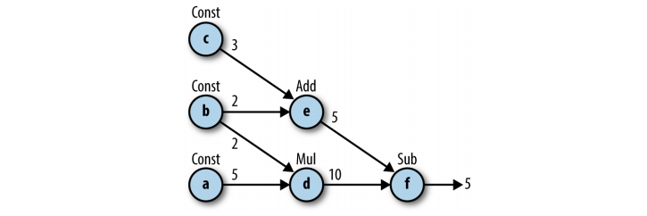

[Tensorflow](https://www.tensorflow.org/) is computation library developed by Google. The library is mainly used in Machine Learning tasks.Let us talk about the basics of Tensorflow in this post.


Let us try and give Newton a competition and aim towards learning Machine Learning and Artificial Neural Networks(to be precise) in this extended vacation of COVID19. So, Let's do this!

## Neural Networks and Deep Learning
A network of neurons in biological sense are called Neural Networks. Mimicing the network to process information on a computer, is called Artificial Neural Network. The Artificial Neural Network is nothing but a graph data structure, that manipulates information from one side to the other.


Each layer of the network consists of weights and bias associated with them. After calculating the linear function using the weights, bias and input values we provided, the results are activated by an activation function and sent further along the network, which finally generate the output. The output of the network is compared with the output we were supposed to be obtain for the input we provided. The generated error is sent back in the direction, opposite to the computation we did. The values of the weights and biases are updated according to the error we obtained. Consider this [video series](https://www.youtube.com/playlist?list=PLZHQObOWTQDNU6R1_67000Dx_ZCJB-3pi) for more reference.


In this way the network learns the output to the respective input. As you may guess, a neural network can even identify functions, and also called universal function approximators. There is even a [mathematical theorem](https://en.wikipedia.org/wiki/Universal_approximation_theorem) based on it!

A class of machine learning algorithms that employ Neural Networks is called Deep Learning.

## Tensorflow
Tensorflow is a software framework used for numerical computations based on dataflow graphs(sounds like Neural Network computations). It is designed primarily, for expressing and implementing machine learning algorithms, cheif among them, neural networks.

Most of Neural Network is based on Linear Algebra and Calculus. Therefore, any simple computation library like Numpy can also be employed to develop these algorithms. **But**, Tensorflow provides features which additionaly faciliate the development of Neural Networks.

- **Portability**: Be it Windows, Linux, Android or iOS, or Raspberry Pi Tensorflow is compatible with all of them.
- **Flexibility**: Provide high level abstractions, so that we do not have to code from scratch.
- **TensorBoard**: Visual debugging tool for Tensorflow
- **Distributed Training**: This one is the most impressive! Tensorflow allows us to train the networks by distributing the task between a network of computers

Let's get started by installing tensorflow!

### Installing Tensorflow
Currently, Tensorflow2.0 is used for development purposes. But, since I could not get my hand on resources for 2.0. I thought learning the previous one 1.15 was good enough. After learning the basic concepts, it would not be difficulty shifting from 1.15 to 2.0. So let's begin!

```bash
pip install tensorflow==1.15
```

Import the tensorflow library

```python
import tensorflow as tf
```

Let's discuss the tensorflow concept using an Example, and working out the details along the way!

### Example A
Tensorflow allows us to implement machine learning algorithms by creating and computing operations that interact with each other. These interactions form a **computation graph**. So, let's start by constructing the given graph example:



#### Constructing the Graph

```python
a = tf.constant(5)	#define a constant value
b = tf.constant(2)
c = tf.constant(3)

d = tf.multiply(a, b)	#operations
e = tf.add(c, b)
f = tf.subtract(d, e)
``` 

I think the code is quite self explanatory. There are a lot of other mathematical operations and datatypes used in Tensorflow. Consider this [link]().

#### Creating the Session
We need to create a session in order to perform the computations, which done by,

```python
sess = tf.Session()	#Create the API object
outs = sess.run(f)	#Run the session and fetch the value
sess.close()		#Always close the session after use

print("outs = {}".format(outs))
```

The output will be, 5.

#### Fetches
One important thing to note above is the function call, `sess.run(f)`. The run function provides us with the value of the node we pass in it! In case we want to get the value of the computation step, e, we will pass the variable e. In order to get the value of all the variables, the code would be:

```python
with tf.Session() as sess:
	fetches = [a, b, c, d, e, f]
	outs = sess.run(fetches)

print("outs = {}".format(outs))
```

The output will be an array of values, `[5, 2, 3, 10, 5, 5]`

### Tensors
Mathematically, a tensor is a multidimensional array.


When we construct a node in the graph, we are create an operation instance. These operations do not produce actual value until the graph is executed. Rather, the represent their *to-be-computed* result as a handle that can be passed on to another node (*flow*). These handles, which are the edges in our graph, are referred to as *Tensor* objects. Therefore, the name **Tensorflow**.

### Variables
In order for us to optimize the weights of a Neural Network, we need variables as well. This is what, the `tf.Variable()` provides us! Variables are computed only when the model runs! For example:

```python
init_val = tf.random_normal((1,5),0,1)		#Provide initial random value
var = tf.Variable(init_val, name='var')		#Variable declaration

init = tf.global_variables_initializer()	#Important whenever we define a variable
with tf.Session() as sess:
	sess.run(init)
	post_var = sess.run(var)

print(post_var)
```

The output would be, `[[0.08596, 0.65885, 0.25370, -0.37380, 0.63552]]`

### Placeholders
In order to feed input values to our neural network, tensorflow provides us with placeholders. Let us take an example for Linear Function,

```python
x_data = np.random.randn(5, 10)		#Initialize random matrix
w_data = np.random.randn(10, 1)

with tf.Graph().as_default:
	x = tf.placeholder(tf.float32, shape=(5, 10))	#Placeholder declaration
	w = tf.placeholder(tf.float32, shape=(10, 1))
	b = tf.fill((5, 1), -1.0)	#Matrix with a value of -1
	xw = tf.matmul(x, w)		#Matrix Multiplication

	xwb = xw + b			#Compute the function
	s = tf.reduce_max(xwb)		#Get the maximum of the output
	
	with tf.Session() as sess:
		outs = sess.run(s, feed_dict={x: x_data, w:w_data})	#Input dictionary

print("outs = {}".format(outs))
```

### Optimization
Tensorflow provides us with functions to evaluate the loss function and the optimization algorithm, we are to use to train the Neural Network.

### Linear Regression
A final example based on Linear Regression, may solidify the knowledge accumulated so far!

```python
NUM_STEPS = 10

g = tf.Graph()
wb_ = []
with g.as_default():
	x = tf.placeholder(tf.float32, shape=[None, 3])		#Shape None is used when we don't know the dimension of the input, and it doesn't affect our computation
	y_true = tf.placeholder(tf.float32, shape=None)
	
	with tf.name_scope('inference') as scope:	#Provides a NameSpace(easier for debugging)
		w = tf.Variable([[0, 0, 0]], dtype=tf.float32, name='weights')
		b = tf.Variable(0, dtype=tf.float32, name='bias')
		y_pred = tf.matmul(w, tf.transpose(x)) + b

	with tf.name_scope('loss') as scope:
		loss = tf.reduce_mean(tf.square(y_true - y_pred))	#Mean Squared Error

	with tf.name_scope('train') as scope:
		learning_rate = 0.5
		optimizer = tf.train.GradientDescentOptimizer(learning_rate)	#Optimizer Function
		train = optimizer.minimize(loss)

	init = tf.global_variables_initializer()
	with tf.Session() as sess:
		sess.run(init)
		for step in range(NUM_STEPS):		#Training for a given number of steps
			sess.run(train, {x: x_data, y_true: y_data})
			if(step % 5 == 0):
				print(step, sess.run([w, b]))
				wb_.append(sess.run([w, b]))

		print(10, sess.run([w, b]))
		
```

This may train a linear regressor based on the input output values we provide!

This is it for this time's blog post!
Stay Safe!
