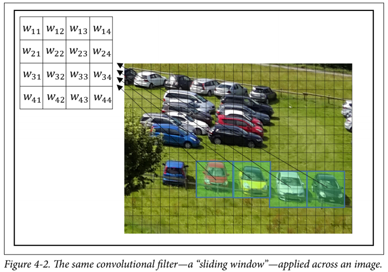

A Convolutional Neural Network, is a Deep Learning algorithm used to analyze visual data like images. CNNs are used in image and video recognition, recommender systems, image classification and medical image analysis. Let us talk about it's implementation in Tensorflow


*Convolutional Neural Network*

## Design of Network
A CNN consists of an input, output and some hidden layers. The hidden layers generally consist of a series of convolutional layers, pooling layers, fully connected layers and normalization layers.

In a convolutional layer of a neural network, each neuron unit is connected to a small number of nearby units in the previous layer. And, all neurons are connected to the previous layer in the same way, with the exact same weights and structure. This leads to an operation known as [convolution](https://en.wikipedia.org/wiki/Kernel_(image_processing)), giving the architecture it's name.


*Convolution Operation*

Each convolutional layer looks at an increasingly large part of the image as we move deeper into the network, which are then followed by fully connected layers. Convolutional Neural Networks are really good at detected **spatial features**, hence they are used in image analysis

### Convolutional Layer
In typical CNN models we stack convolutional layers hierarchically. The layers apply a filter on our input image and output a *feature map*. The weights *W* in the sliding window, are the parameters that our network learns!



Tensorflow contains `conv2d()` to generate a convolutional layer.

```python
tf.nn.conv2d(x, W, strides=[1, 1, 1, 1], padding="SAME")
```

Here `x` is the input image, or a feature map obtained from some other layer. The strides argument controls the spatial movement of the filter across the input. The value `[1, 1, 1, 1]` means that the filter is applied to the input in one-pixel intervals in each dimension. Other values allow us to skip some parts as well. The padding setting `'SAME'`, makes the borders of `x` padded such that the size of the result of the operation is the same as the size of `x`.

### Pooling Layer
*Pooling* means to reduce the size of the data with some statistical function. This layer is used to reduce the size of the parameters in the following layers. Theoretically, pooling layer help our network in dealing with little variability. For example, a network trained to detect eyes, should be robust enough to detect them, even if the camera is moved slightly to the left or right. In Tensorflow, we have


*Max Pooling Operation*

```python
tf.nn.max_pool(x, ksize=[1, 2, 2, 1], strides=[1, 2, 2, 1], padding='SAME')
```

Max Pooling outputs the maximum of the input in each region of a predefined size. The `ksize` argument controls the size of the pooling(in this case we have `2x2`) and the `strides` argument controls the sliding(in this case we have `2x2`, meaning the output will be half the height and width of input)

### Dropout
Dropout is a regularization technique, used to prevent overfitting. Dropout randomly turns some neurons *off*, forcing the network to work without the help of those neurons. When the classifier is used at test time, we should apply no dropout.


*Dropout Operation*

```python
tf.nn.dropout(layer, keep_prob = keep_prob)
```

### Activation Layer
Following a convolutional or fully connected layer, we apply an activation function, in order for our network to learn non-linear information as well!


*Activation Functions*

### Model
In order to make clean and efficient code, we need to create some helper functions first!

```python
def weight_variable(shape):		#Initialize the tensorflow weight variable
	initial = tf.truncated_normal(shape, stddev=0.1)
	return tf.Variable(initial)

def bias_variable(shape):		#Initialize the tensorflow bias variable
	initial = tf.constant(0.1, shape=shape)
	return tf.Variable(initial)

def conv2d(x, W):			#The Convolution Operation
	return tf.nn.conv2d(x, W, strides=[1, 1, 1, 1], padding="SAME")

def max_pool_2x2(x):			#Max Pooling Operation
	return tf.nn.max_pool(x, ksize=[1, 2, 2, 1], strides=[1, 2, 2, 1], padding="SAME")

def conv_layer(input, shape):		#Convolution Layer
	W = weight_variable(shape)
	b = bias_variable([shape[3]])
	return tf.nn.relu(conv2d(input, W) + b)

def full_layer(input, size):		#Dense Layer
	in_size = int(input.get_shape()[1])
	W = weight_variable([in_size, size])
	b = bias_variable([size])
	return tf.matmul(input, W) + b
```

Using these layers we may get the model as:

```python
x = tf.placeholder(tf.float32, shape=[None, 784])
y_ = tf.placeholder(tf.float32, shape=[None, 10])

x_image = tf.reshape(x, [-1, 28, 28, 1])
conv1 = conv_layer(x_image, shape=[5, 5, 1, 32])
conv1_pool = max_pool_2x2(conv1)

conv2 = conv_layer(conv1_pool, shape=[5, 5, 32, 64])
conv2_pool = max_pool_2x2(conv2)

conv2_flat = tf.reshape(conv2_pool, [-1, 7 * 7 * 64])
full_1 = tf.nn.relu(full_layer(conv2_flat, 1024))

keep_prob = tf.placeholder(tf.float32)
full1_drop = tf.nn.dropout(full_1, keep_prob = keep_prob)

y_conv = full_layer(full1_drop, 10)
```


### Running the Model

```python
mnist = input_data.read_data_sets(DATA_DIR, one_hot=True)	#Using MNIST data, this feature is not available in Tensorflow2.0

cross_entropy = tf.reduce_mean(tf.nn.softmax_cross_entropy_with_logits(logits=y_conv, labels=y_))

train_step = tf.train.AdamOptimizer(1e-4).minimize(cross_entropy)

correct_prediction = tf.equal(tf.argmax(y_conv, 1), tf.argmax(y_, 1))
accuracy = tf.reduce_mean(tf.cast(correct_prediction, tf.float32))

with tf.Session() as sess:
	sess.run(tf.global_variables_initializer())

	for i in range(STEPS):
		batch = mnist.train.next_batch(50)		#Not in Tensorflow 2.0
		
		if i % 100 == 0:
			train_accuracy = sess.run(accuracy, feed_dict={x: batch[0], y_: batch[1], keep_prob: 1.0})
			print("step {}, training accuracy {}".format(i, train_accuracy))

		sess.run(train_step, feed_dict={x: batch[0], y_: batch[1], keep_prob: 0.5})

	X = mnist.test.images.reshape(10, 1000, 784)
	Y = mnist.test.labels.reshape(10, 1000, 10)
	test_accuracy = np.mean([sess.run(accuracy, feed_dict={x:X[i], y_:Y[i], keep_prob:1.0}) for i in range(10)])

print("Test Accuracy: {}".format(test_accuracy))
```

This trains a model with a relatively good performance, **almost 99%**. Hope it provides a good starting point, to people starting out with CNNs.


