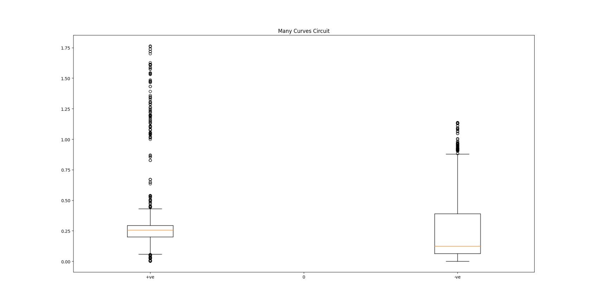
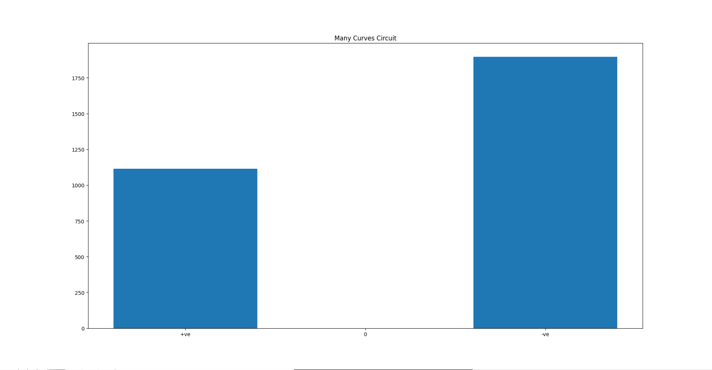
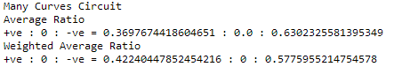
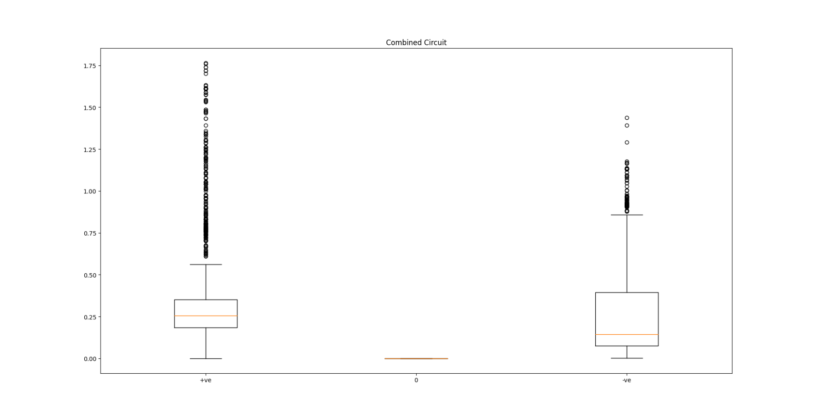
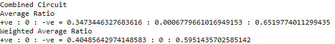

The data for our training is generated by running the Formula 1 Car on the red line racing track. The car follows the red line using PID based Control and the control commands and the images are collected while the car is running using Behavior Metrics. The data is collected from the Simple Circuit and the Many Curves Circuit.

## Simple Circuit

### Circuit Analysis

*Angular Velocity Plot on Circuit*

### Box Plot

*Box Plot*

### Bar Plot

*Bar Plot*

### Statistics

*Statistics*

## Many Curves Circuit

### Circuit Analysis

*Angular Velocity Plot on Circuit*

### Box Plot

*Box Plot*

### Bar Plot

*Bar Plot*

### Statistics

*Statistics*

## Combined Data

### Box Plot

*Box Plot*

### Bar Plot

*Bar Plot*

### Statistics

*Statistics*

## Conclusions

1. There is a data imbalance between the positive and the negative angular velocity values. Approximately the ratio of positive to negative is 40 : 60. Additionally, the weighted average more or less follows a similar ratio.

2. The spread of positive angular velocity is greater than the negative velocity. This is especially visible in the Many Curves circuit, the positive values are more skewed.

3. There is no clear distinction of the positive negative with the clockwise and anticlockwise turns on the circuit. This is especially evident in the Many Curves circuit.

## Inference

1. It was observed while training the NARX network : Training on the data as it is, resulted in poor performance. However, increasing the positive angular velocity samples improved the performance of the network.

2. During training the networks, a preprocessing technique that we apply is flipping the images. While there is an imbalance of the angular velocity data, flipping the images equalizes the positive and negative samples. But, considering the velocity plot on circuit, this may actually confuse the network as there is no clear distinction of clockwise and anticlockwise turns.

3. No matter how the data is and how it is distributed. We have a good collection of networks that perform really well on the different circuits. This should imply that the networks learn to maneuver inspite of the absence of that distinction.

## Next Steps / Curiosity wise

1. What if we collect more data by running the car backwards in the two circuits? That may also help in equalizing the data.

2. What if, while training, we manually increase / adjust the angular velocity values by scaling them with a small factor like 1.1 or 1.2? This may help balance the weighted distribution.