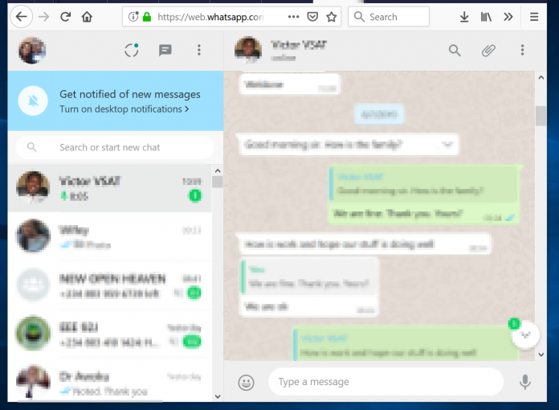
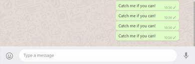

Automation is the technology by which a process can be carried out with minimal human assistance. Automation can be hardware or software based. In this post we are going to talk about a software based web automation process using the python library Selenium. 


*Far off in the future, maybe?*


*This is cool!*

### Selenium and its Functions 
As the name suggests, manipulating data from a web source is called **Web Automation**. It can include anything like sending emails, messages and even deleting those emails and messages. Automatic **Data Scraping** is another great example of Web Automation. Selenium is a powerful tool for controlling web browser through computer program. The automation scripts can be written in various languages, and run for various browsers. All those simple web automation tasks can be simply acheived in minimal amount of code using the Selenium Library.

Possiblities with Selenium are endless! So, let's keep our circle small. We are going to discuss Automatic Whatsapp Messaging, on Google Chrome Browser using Python Language as a test example to use Selenium.

### Installation
First of all, install the python bindings of Selenium. This will make the selenium library ready to be used in our python code.
```bash
pip install selenium
```

Selenium requires a web driver to interface with the chosen browser. A simple google search may yield the required drivers for a particular web browsers. Here are the links for [Chrome](https://sites.google.com/a/chromium.org/chromedriver/downloads), [FireFox](https://github.com/mozilla/geckodriver/releases), [Safari](https://webkit.org/blog/6900/webdriver-support-in-safari-10/).

### The Code

#### Importing Libraries
Import all these libraries, the function of each will be explained as we go along.

```python
from selenium import webdriver
from selenium.webdriver.support.ui import WebDriverWait
from selenium.webdriver.support import expected_conditions as EC
from selenium.webdriver.common.keys import Keys
from selenium.webdriver.common.by import By
import time
```

#### Import the Web Driver
Get the path of the web driver wherever it is on your local system. A much simpler way would be by placing the script and the driver in the same folder. In which case, you will have the address `./driver_name`.

```python
driver = webdriver.Chrome('Path of Web Driver goes here')
```

#### Set the web address
Set the website address, of the webpage we want to automate. In our case, it is the WhatsApp Web. In case, you have never used the Web Service, upon starting it, we have to scan a QR Code to allow the Web Service to be active. The other command `WebDriverWait` is going to wait until we scan the code from our phone. Followed by that, we have `time.sleep(2)` to wait until we get the chat screen.

```python
driver.get("https://web.whatsapp.com/")
wait = WebDriverWait(driver, 600)
time.sleep(3)
```



*WhatsApp Web*

#### Scrapping elements from HTML
This is the toughest part of any Selenium Project. In order to scrape any data from the webpage, we need to know its location, and location is determined through HTML. To navigate through the HTML document of the Webpage, we use what is called XPATH. XPATH stands for XML Path Language. As the name suggests, it is used to navigate through XML files. XPATH being a vast topic, let us confine ourselves to just building the Message Automater. In case, somebody feels curious, here is a [wonderful link](https://www.w3schools.com/xml/xpath_intro.asp) to learn about it. Another [wonderful link](https://www.google.com) for the over curious ones!

For our purpose, we need to select the Contact from Contact Pane, to whom we want to message, and get the text box, in the Message Pane, to type our message.

```python
target = 'Your Contact Name goes here!'

x_arg = '//span[@title="' + target + '"]' #XPATH
group_title = wait.until(EC.presence_of_element_located((By.XPATH, x_arg)))
group_title.click()

inp_xpath = "//div[@contenteditable='true']"    #XAPTH
input_box = wait.until(EC.presence_of_element_located((By.XPATH, inp_xpath)))
```

The above XPATH `//span[@title='']` aims to find an HTML tag called span, with title attribute equal to the target name, and the other one `//div[@contenteditable='true']` aims to find an HTML tag called div, with contenteditable attribute equal to true. Other commands are pretty self explanatory!


*Take care that your contact names do not have emojis, otherwise it is difficult to pinpoint them!*

Here is the catch, in order to make our driver application possible, we require HTML tags that are unique in one way or another. A tag may be unique as a tag itself, or a unique attribute value. Now, it may be easy to understand, why it's the **toughest part**. We have to manually search through the HTML document of the website to find **uniqueness in data**. The more unique the tag we want to interact with, the easier our job becomes! Some times it can be as easy as finding an `input` tag because the webpage has only one input tag.

XPATH is the one making our job easier in this case. So, knowing XPATH is a good way to go!

#### Automatic Typing
I originally made the script to prank people by spamming them. Well, as a result, your contact is blocked by the other person, you are trying to mess with! 

```python
string = "Your message goes here!"

#The prank version 5300 messages
for i in range(5300):
    input_box.send_keys(string + Keys.ENTER)
    time.sleep(2)
```

Regular users of the Web Service would have noticed that upon pressing ENTER key, the message gets sent. This is exploited in the above snippet, the Keys.ENTER virtually presses the ENTER key after the string is inserted in the text box.

`time.sleep(2)` plays a major role here. It halts our program until Selenium can type the message in the `input_box`. Too little a time, and our message gets sent in chunks, or not at all. Too long, and our prank becomes useless! Also, as a general note, `time.sleep()` is a crucial part of any Selenium Project. Some websites, can block our IPs if we continously keep pinging the servers. So, a correct balance of halt is a necessary part!



*Devil Laugh*

### Final Remarks


*How to stop spamming!*

So, this is it! That's how you can spam people, with some simple code #NotoriousProgramming. As can be seen, making Selenium based automation scripts are easy to do if you know what you are doing. There are a lot of possibilties with these scripts. So, go out there and explore those!

