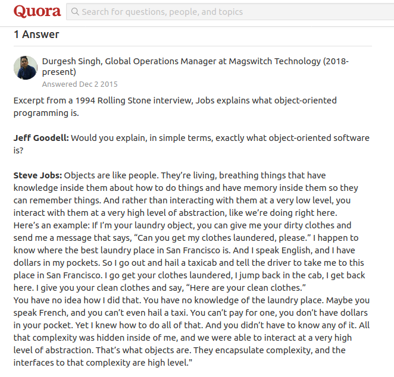

The heading may seem grammatically incorrect, as we can only talk **to** robots and not have a 2 way **conversation** with robots. Read on the article to find out some philosophical ideas of how we can talk **with** these magnificient machines! 

### The Essence of Engineering 
According to [Wikipedia](https://en.wikipedia.org/wiki/Engineering), engineering is the use of scientific principles to design and build machines, structures, and other items, including bridges, tunnels, roads, vehicles, and buildings. An engineer should be able to understand the basic fundamentals and logic behind his/her creation to design an efficient structure.

Philosophically, relating a human to a machine. In order to understand other humans, we require communication. It is through communication, that we are able to get our ideas through each other. Similarly, we require proper communication with machines to effectively understand them, and hence design them!

Hence, it may not be wrong to say, that Engineering is all about **learning to talk to machines**.

*Even Tony Stark does that!*

*Connecting Ideas*

### Examples
Machines don't work unless we've communicated with them(Taken from this amazing [Medium Article](https://towardsdatascience.com/talking-to-machines-3da09845c251)). It's really easy to see with earlier machines. Take for example, **ABACUS**: A Physical Interface where our fingers communicate with the machine, and it in turn communicates with us the result of the computation.

*The Simplest Machine*

Take another complex example, **BRIDGES**: Any mechanical structure, like bridge is an architectural/civil product. Avoiding proper communication, and not understanding with this structure, causes severe damage to property and life.

*The Forces and Torque at various places are the ways through which a bridge can communicate with us*

A more sophisticated example would be, **SOFTWARE**: A code running on computer, is one of the toughest things to communicate with! Debugging a code requires the programmer to effectively communicate with the computer and understand where the error in the code lies!

*It becomes very difficult to visualise a Data Structure like Tree. We only know the values at nodes, and not their actual locations!*

### Communicating with Robots
Robots are one of the most complex machines of all times, encompassing 3 core areas of engineering, Mechanical, Electrical and Computer Science. The best way to deal with these machines, is through simulations. Simulations take our communication with the robot to a different level. They help us seek and debug the mechanical constraints as well as the software constraints present in our code or machine. Apart from the philosophical discussion, simulations also provide us with the [following benefits](https://www.theconstructsim.com/why-robotics-companies-must-use-simulators/):

- Test ideas prior to building the robot
- Paralelize development
- Efficient Testing and Debugging
- Easy modifications and improvements
- Easy Access to Public

*Robot Manipulator Simulation*

*Google DeepMind AI taught itself to run*

All these points, effectively prove the point that simulations are really important in understanding the basic logic behind our design, making communication with machines an integral and important part of design process.

Placing my point on the table, I would leave it to the reader to decide, whether or not Engineering is an *art of talking with machines*.
