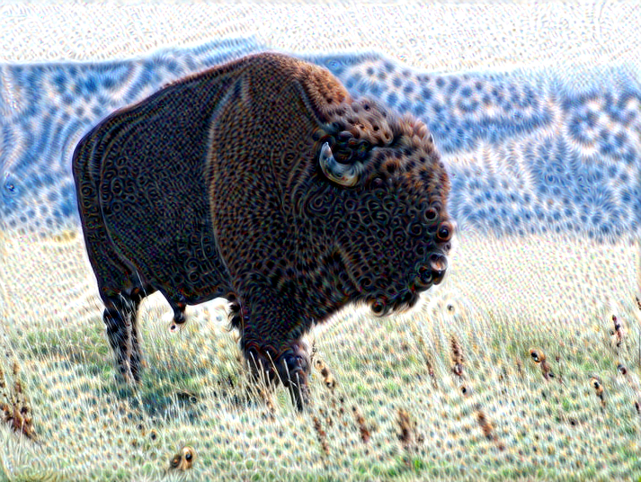
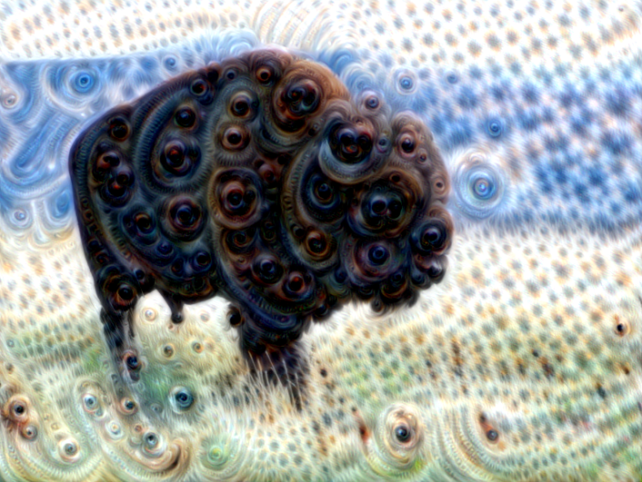
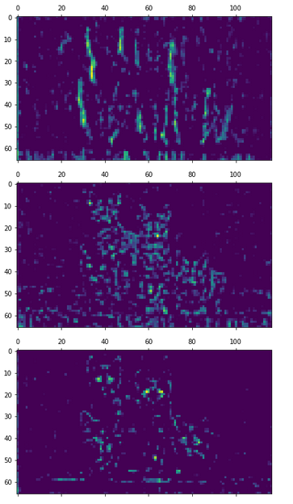

Deep Dream is a computer vision program, developed by Google engineer Alexander Mordvintsev that turns simple images into dream-like psychedelic image. The program uses CNNs behind the scenes to make this happen. This post discusses about this algorithm and its implementation.


*Let's get high!*

## Deep Dream Algorithm
Convolutional Neural Networks trained on classification of tasks, are designed to detect faces and patterns in images. However, once trained, the network can also be used to do the reverse task, and adjust the input image slightly to make those patterns appear in the image. After enough reiterations, the network starts to amplify the patterns in the image and gives us really creepy images.

First, some layers of the Neural Network are selected. An image is then passed again and again through the network, while calculating the loss. By means of **gradient ascent**(not gradient descent), we try to amplify the activations resulting from the loss function. These loss images are then added iteratively to the input image. Thus resulting in images with amplified features.


*Incpetion Neural Network we are going to use*

Apart from recreational purposes, the algorithm can be used to study the layers of the Neural Networks, as to which classification task they are performing.

Let's focus on its implementation


*Let's go deep*

## Initialization
In order to get started with the program, we need a CNN trained on detection tasks. Inception5h model will be the one used for this purpose. Inception is an object detection CNN developed by Google.

### Downloading the Network
First of all we will download the weights and configuration of the network.

Define the directory names
```python
# Internet URL for the tar-file with the Inception Model
data_url = "http://storage.googleapis.com/download.tensorflow.org/models/inception5h.zip"

# Directory to store the downloaded data
data_dir = "inception/5h/"

# File containing the Tensorflow graph definition(Will be downloaded in inception/5h)
path_graph_def = "tensorflow_inception_graph.pb"
```

Download and extract
```python
# Download the file from the internet
file_path, _ = urllib.request.urlretrieve(url=data_url, filename=data_dir)

# Unpack the zip file
zipfile.ZipFile(file=file_path, mode='r').extractall(data_dir)
```

### Working with Inception
The unzipped file contains proto-buf configuration files, which are to be loaded into our code

```python
class Inception5h:
  """
  The Inception model is a Deep Neural Network which has already been
  trained for classifying images into 1000 different categories.

  When you create a new instance of this class, the Inception model
  will be loaded and can be used immediately without training
  """

  # Name of the tensor for feeding the input image
  tensor_name_input_image = "input:0"

  # Names for some of the commonly used layers in the Inception model
  layer_names = ['conv2d0', 'conv2d1', 'conv2d2',
                 'mixed3a', 'mixed3b',
                 'mixed4a', 'mixed4b', 'mixed4c', 'mixed4d', 'mixed4e',
                 'mixed5a', 'mixed5b']

  def __init__(self):
    # Load the inception model from the file.

    # Create a new TensorFlow computational graph
    self.graph = tf.Graph()

    # Set the new graph as the default
    with self.graph.as_default():
      # Tensorflow graphs are saved to disk as proto-bufs
      # which is a file-format that works on multiple platforms.
      # In this case it is saved as a binary file

      # Open the graph-def file for binary reading.
      path = os.path.join(data_dir, path_graph_def)
      
      with tf.io.gfile.GFile(path, 'rb') as file:
        # The graph-def is a saved copy of a TensorFlow graph.
        # First we need to create an empty graph-def
        graph_def = tf.compat.v1.GraphDef()

        # Then we load the prot-buf file into the graph-def
        graph_def.ParseFromString(file.read())

        # Finally we import the graph-def to the default Tensorflow graph
        tf.import_graph_def(graph_def, name='')

        # Now self.graph holds the Inception model from the proto-buf file
      
      # Get a reference to the tensor for inputting the images to the graph
      self.input = self.graph.get_tensor_by_name(self.tensor_name_input_image)

      # Get references to the tensors for the commonly used layers
      self.layer_tensors = [self.graph.get_tensor_by_name(name + ":0") for name in self.layer_names]

  def create_feed_dict(self, image=None):
    """
    Create and return a feed-dict with an image

    image: Input image is a 3-dim array which is already decoded
           The pixels MUST be values between 0 and 255 (float or int)

    return: Dict for feeding to the Inception graph in TensorFlow 
    """

    # Expand 3-dim array to 4-dim by prepending an 'empty' dimension.
    # This is because we are only feeding a single image, but the
    # Inception model was built to take multiple images as input
    image = np.expand_dims(image, axis=0)

    # Image is passed in as a 3-dim array of raw pixel-values.
    feed_dict = {self.tensor_name_input_image: image}

    return feed_dict

  def get_gradient(self, tensor):
    """
    Get the gradient of the given tensor with respect to
    the input image. This allows us to modify the input
    image so as to maximize the given tensor.
    (For use in DeepDream and Visual Analysis)

    tensor: Tensor whose value we want to maximize
    return: Gradient for the tensor with regard to the input image
    """

    # Set the graph as default so we can add operations to it
    with self.graph.as_default():
      # Square the tensor-values
      tensor = tf.square(tensor)

      # Average the tensor so we get a single scalar value
      tensor_mean = tf.reduce_mean(tensor)

      # Use Tensorflow to automatically create a mathematically
      # formula for the gradient using the chain-rule
      gradient = tf.gradients(tensor_mean, self.input)[0]

    return gradient
```

### Using the Model

```python
model = Inception5h()
```

## The Algorithm
Now, let's code the functions that are actually going to be used in the algorithm.

### Gradient
This function will calculate the gradient of an input image. The Inception model can accept images of any size, but very large images may use many GBs of RAM. In order to keep the RAM usage low, we will split the input image into smaller tiles and calculate the gradient for each of the tiles.

However, this may result in visible lines in the final images produced by the algorithm. We therefore choose the tiles randomly so the locations of the tiles are always different. This makes the seams between the lines invisible in the final image.

```python
# Function to determine an appropriate tile-size
# Tile size depends on image-dimensions
def get_tile_size(num_pixels, tile_size=400):
  """
  num_pixels: number of pixels in dimension of the image
  tile_size: desired tile_size
  """

  # How many times can we repeat a tile of the desired size
  num_tiles = int(round(num_pixels / tile_size))

  # Ensure that there is at least 1 tile
  num_tiles = max(1, num_tiles)

  # The actual tile size
  actual_tile_size = math.ceil(num_pixels / num_tiles)

  return actual_tile_size

# Function to compute gradient for an input image
# The image is split into tiles and gradient calculated for each tile
# The tiles are chosen randomly to avoid visibile seems
def tiled_gradient(gradient, image, tile_size=400):
  # Allocate an array for the gradient of the entire image
  grad = np.zeros_like(image)

  # Number of pixels for the x and y axes
  x_max, y_max, _ = image.shape

  # Tile size for the x axis
  x_tile_size = get_tile_size(num_pixels=x_max, tile_size=tile_size)
  # 1/4 of the tile size
  x_tile_size4 = x_tile_size // 4

  # Tile size for the y axis
  y_tile_size = get_tile_size(num_pixels=y_max, tile_size=tile_size)
  # 1/4 of the tile size
  y_tile_size4 = y_tile_size // 4

  # Random start position for the tiles on the x axis
  # The random value is between -3/4 and -1/4 of the tile-size
  # This is so the border tiles are at least 1/4 of the tile size
  # otherwise the tiles may be too small which creates noisy gradient
  x_start = random.randint(-3*x_tile_size4, -x_tile_size4)

  while x_start < x_max:
    # End position for the current tile
    x_end = x_start + x_tile_size

    # Ensure the tile's start and end positions are valid
    x_start_lim = max(x_start, 0)
    x_end_lim = min(x_end, x_max)

    # Random start position for the tiles on the y axis
    # The random value is between -3/4 and -1/4 of the tile size
    y_start = random.randint(-3*y_tile_size4, y_tile_size4)

    while y_start < y_max:
      # End position for the current tile
      y_end = y_start + y_tile_size

      # Ensure the tiles start and end positions are valid
      y_start_lim = max(y_start, 0)
      y_end_lim = min(y_end, y_max)

      # Get the image tile
      img_tile = image[x_start_lim:x_end_lim, y_start_lim:y_end_lim, :]

      # Create a feed dict with the image tile
      feed_dict = model.create_feed_dict(image=img_tile)

      # Use TensorFlow to calculate the gradient value
      g = session.run(gradient, feed_dict=feed_dict)

      # Normalize the gradient for the tile. This is
      # necessary because the tiles may have very different
      # values. Normalizing gives a more coherent gradient
      g = g / (np.std(g) + 1e-8)

      # Store the tile's gradient at the appropriate location
      grad[x_start_lim:x_end_lim, y_start_lim:y_end_lim, :] = g

      # Advance the start position for the y axis
      y_start = y_end

    # Advance the start position for x axis
    x_start = x_end

  return grad
```

### Image Optimization
The optimization loop for the algorithm. It calculates the gradient of the given layer of the Inception model with regard to the input image. The gradient is then added to the input image so the mean value of the tensor is increased. This process is repeated a number of times and amplifies the pattherns the Inception model sees in the input image.

```python
# Function to optimize an image
# Maximizes the mean value of the given layer_tensor
# Using gradient ascent
def optimize_image(layer_tensor, image, num_iterations=10, step_size=3.0, tile_size=400, show_gradient=False):
  """
  layer_tensor: Reference to a tensor that will be maximized
  image: Input image to be used as starting point
  num_iterations: Number of optimization iterations to perform
  step_size: Scale for each step of the gradient ascent
  tile_size: Size of the tiles when calculating the gradient
  show_gradient: Plot the gradient in each iteration
  """

  # Copy the image so we don't overwrite the original image
  img = image.copy()

  print("Image before:")
  plot_image(img)

  print("Processing image: ", end="")

  # Use TensorFlow to get the mathematical function for the
  # gradient of the given layer tensor with regard to the
  # input image. This may cause TensorFlow to add the same
  # math-expressions to the graph each time this function is called
  # It may use a lot of RAM and could be moved outside the function
  gradient = model.get_gradient(layer_tensor)

  for i in range(num_iterations):
    # Calculate the value of the gradient
    # This tells us how to change the image so as to
    # maximize the mean of the given layer-tensor
    grad = tiled_gradient(gradient=gradient, image=img)

    # Blur the gradient with different amounts and add
    # them together. The blur amount is also increased
    # during the optimization. This was found to give
    # nice, smooth images. The blur-amount is called
    # sigma (0=no blur, 1 = low blur, etc.) We could
    # call gaussian_filter(grad, sigma=(sigma, sigma, 0.0))
    # which would not blur the color channel. This tends to
    # give psychadelic / pastel colors in the resulting images
    # When the color channel is also blurred the colors of the
    # input image are mostly retained in the output image
    sigma = (i * 4.0) / num_iterations + 0.5
    grad_smooth1 = gaussian_filter(grad, sigma=sigma)
    grad_smooth2 = gaussian_filter(grad, sigma=sigma*2)
    grad_smooth3 = gaussian_filter(grad, sigma=sigma*0.5)
    grad = (grad_smooth1 + grad_smooth2 + grad_smooth3)

    # Scale the step-size according to the gradient-values
    # This may not be necessary because the tiled-gradient
    # is already normalized
    step_size_scaled = step_size / (np.std(grad) + 1e-8)

    # Update the image by following the gradient
    img = img + grad * step_size_scaled
    # Let's try this then!
    # img = img - grad * step_size_scaled

    if show_gradient:
      # Print statistics for the gradient
      msg = "Gradient min: {0:>9.6f}, max: {1:>9.6f}, stepsize: {2:>9.2f}"
      print(msg.format(grad.min(), grad.max(), step_size_scaled))

      # Plot the gradient
      plot_gradient(grad)

    else:
      # Otherwise show a little progress indicator
      print(".", end="")
  
  print()
  print("Image after:")
  plot_image(img)

  return img
```

### Recursive Optimization
Function to downscale the input image several times recursively. This will result in larger patterns in the final image, and speed up computation as well!

```python
def recursive_optimize(layer_tensor, image, num_repeats=4, rescale_factor=0.7, blend=0.2, num_iterations=10, step_size=3.0, tile_size=400):
  """
  Recursively blur and downscale the input image
  Each downscaled image is run through the optimize_image()
  function to amplify the patterns that the Inception model sees

  image: Input image
  rescale_factor: Downscaling factor for the image
  num_iterations: Number of optimization iterations to perform
  step_size: Scale for each step of the gradient ascent
  tile_size: Size of the tiles when calculating the gradient
  """

  # Recursion
  if num_repeats > 0:
    # Blur the image to prevent artifacts when downscaling
    # The blur amount is controlled by sigma. Note that the
    # color channel is not blurred as it would make the image gray
    sigma = 0.5
    img_blur = gaussian_filter(image, sigma=(sigma, sigma, 0.0))

    # Downscale the image
    img_downscaled = resize_image(image=img_blur, factor=rescale_factor)

    # Recursive call to this function
    # While subtracting num_repeats
    img_result = recursive_optimize(layer_tensor=layer_tensor,
                                    image=img_downscaled,
                                    num_repeats=num_repeats-1,
                                    rescale_factor=rescale_factor,
                                    blend=blend,
                                    num_iterations=num_iterations,
                                    step_size=step_size,
                                    tile_size=tile_size)
    
    # Upscale the resulting image back to its original size
    img_upscaled = resize_image(image=img_result, size=image.shape)

    # Blend the original and processed images
    image = blend * image + (1.0 - blend) * img_upscaled

  print("Recursive level:", num_repeats)

  # Process the image using DeepDream algorithm
  img_result = optimize_image(layer_tensor=layer_tensor,
                              image = image,
                              num_iterations=num_iterations,
                              step_size=step_size,
                              tile_size=tile_size)

  return img_result 
```

## Running the algorithm

### TensorFlow Session
Execute an interactive tensorflow session

```python
session = tf.compat.v1.InteractiveSession(graph=model.graph)
```

### Execute the Algorithm
Let's select a random layer tensor and execute the algorithm

```python
image = load_image(filename='images/scene.jpg')

layer_tensor = model.layer_tensors[4]

img_result_1 = optimize_image(layer_tensor, image, num_iterations=10, step_size=6.0, tile_size=400)

img_result_2 = recursive_optimize(layer_tensor=layer_tensor, image=image, num_iterations=10, step_size=3.0, rescale_factor=0.7, num_repeats=4, blend=0.2)
```

### Results


*The input image*



*img_result_1*



*img_result_2*

As can be seen `img_result_1` has a lot of high frequency content, compared to `img_result_2`

### Analyzing the Layer
We have an activation function that gets our feature maps

```python
# Function to classify a single image
def activations(tensor, image=None):
  """
  image_path: The input image is a jpeg-file with this file-path
  image: The input image is a 3-dim array which is already decoded
         The pixels must be uint8 format

  return: Array of floats(softmax array) indicating how likely
          the Inception model thinks the image is of each given class
  """

  # Create a feed-dict for the TensorFlow graph with the input image
  feed_dict = model.create_feed_dict(image)

  # Execute the TensorFlow session to get the predicted labels
  pred = session.run(tensor, feed_dict=feed_dict)

  return pred
```

Since we got a lot eyes and fur in the final image, the layers in our network ought to detect these features. Let's observe some of the feature maps based on a cat image.

```python
cat_image = load_image(filename='images/cats.jpeg')

layer_name = 'mixed3b:0'	# This is the name of the layer we selected above

activate = activations(layer_name, cat_image)

i = 0		#i can be 0, 1, 2 ... number of feature maps for a given layer
plt.matshow(activate[0, :, :, i], cmap='virdis')
```

Following are the feature maps we get. They show the feature activations we get for the input image.


*The Cat Image*



*Feature Maps for i=1, 2 and 5*


