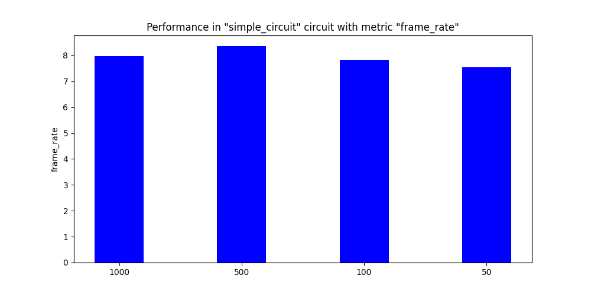

The RTF (Real Time Factor) plays a crucial role in determining the performance of the network. According to qualitative experiments (visually observing behavior), the NARX network is able to complete a difficult curve in Montmelo Circuit when the RTF is reduced. In this blog post, we study the effects of changing Real Time Update Rate on NARX network quantitatively for Simple Circuit.

Following are some of the graphs. The X axis shows the Real Time Update Rate set in Gazebo and the Y axis shows the corresponding quantity under study.

## Real Time Factor

*Comparision of Real Time Factor*

## Position Deviation (MAE)

*Comparision of Position Deviation (MAE)*

## Lap Seconds

*Comparision of Lap Seconds*

## Average Speed

*Comparision of Average Speed*

## Frame Rate

*Comparision of Frame Rate*

## Mean Iteration Time

*Comparision of Mean Iteration Time*

## Mean Inference Time

*Comparision of Mean Inference Time*

## Mean ROS Iteration Time

*Comparision of Mean ROS Iteration Time*

## Observations

1. The RTF graph is similar for 1000 and 500 Real Time Update Rate. The change takes place for smaller values of 100 and 50.

2. The Mean Iteration Time, Mean Inference Time and Mean ROS Iteration Time show an increasing trend with the reduction of the Real Time Update Rate. A similar trend can be observed for the Lap Time. A decreasing trend is observed for Position Deviation.

3. The Frame Rates for all the different Real Time Update Rates are quite low.

## Conclusions

The main objective of conducting these experiments was to determine the capabilities of my computer. From the RTF graph, it is clearly visible that the computer is not able to achieve the desired performance with 1000 and 500 Real Time Update Rates. The best performance is given by 100 and 50. The other graphs also point out a similar conclusion. Hence, intuitively, 100 should be the most optimal value for conducting experiments as this value allows the simulator to run well and algorithm that is running on it.
