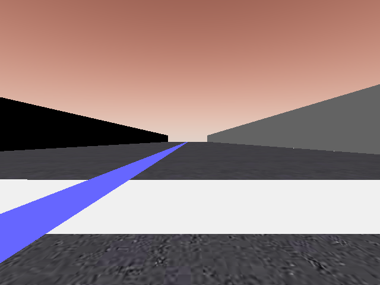
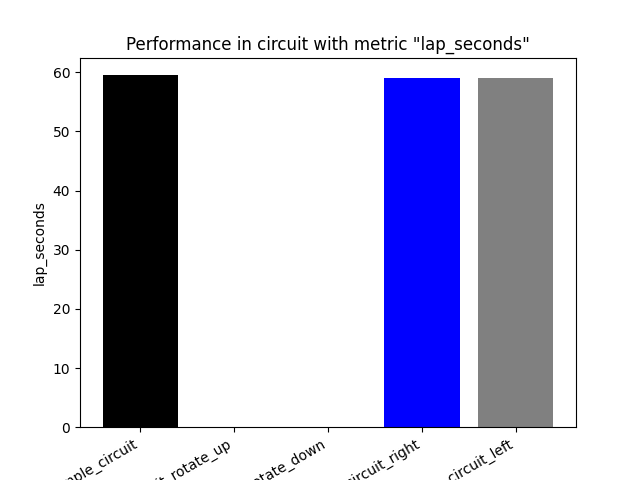

Generaly, Neural Network based algorithms should be more robust compared to hard coded algorithms. A similar case should be expected for our Visual Control algorithm as well. In this post, we study the performance of the brains by changing the camera position.

# Camera Offset

The images obtained by different camera positions are:

Original                   |  Left                    |  Right                    |  Rotate Up                    |  Rotate Down                    |
:-------------------------:|:-------------------------:|:-------------------------:|:-------------------------:|:-------------------------:
 |  |  |  | 

# PilotNet

Following are the graphs

## Position Deviation Error

*Comparision of Position Deviation Error*

## Position Deviation (MAE)

*Comparision of Position Deviation (MAE)*

## Percentage Completed

*Comparision of Percentage Completed*

## Lap Seconds

*Comparision of Lap Seconds*

## Average Speed

*Comparision of Average Speed*

# Deepest LSTM Tiny PilotNet

Following are the graphs

## Position Deviation Error

*Comparision of Position Deviation Error*

## Position Deviation (MAE)

*Comparision of Position Deviation (MAE)*

## Percentage Completed

*Comparision of Percentage Completed*

## Lap Seconds

*Comparision of Lap Seconds*

## Average Speed

*Comparision of Average Speed*

# Explicit Method

Following are the graphs

## Position Deviation Error

*Comparision of Position Deviation Error*

## Position Deviation (MAE)

*Comparision of Position Deviation (MAE)*

## Percentage Completed

*Comparision of Percentage Completed*

## Lap Seconds

*Comparision of Lap Seconds*

## Average Speed

*Comparision of Average Speed*

# Observations

1. Car having the camera rotated up, never completes the circuit.

2. For the Deep Learning brains, the rotate up and rotate down, both of them do not complete the circuit. However, the rotate down completes the lap for Explicit Brain.

3. The Right and Left camera offsets are able to complete the circuits, but, have a higher error compared to the original camera position. 

# Conclusions

It was expected for the PilotNet and DeepestLSTM networks to perform well for the Left, Right and Rotated Down camera offsets. For Left and Right, this was well observed, but for Rotate Down the brains did not perform the same. This may be due to the croping that is done before processing the image. Due to that, a particular field of view of the image may be blocked that is helpful for the network to work.
