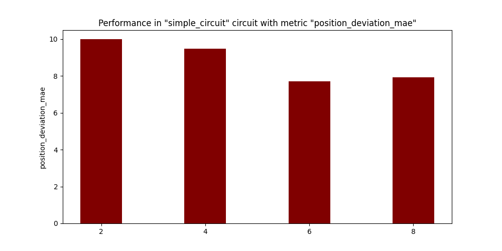

Generaly, Neural Network based algorithms should be more robust compared to hard coded algorithms. A similar case should be expected for our Visual Control algorithm as well. In this post, we study the performance of the brains by adding noise.

# PilotNet

## Salt & Pepper Noise

Following are the graphs

### Position Deviation Error

*Comparision of Position Deviation Error*

### Position Deviation (MAE)

*Comparision of Position Deviation (MAE)*

### Percentage Completed

*Comparision of Percentage Completed*

### Lap Seconds

*Comparision of Lap Seconds*

### Average Speed

*Comparision of Average Speed*

## Gaussian Noise

Following are the graphs

### Position Deviation Error

*Comparision of Position Deviation Error*

### Position Deviation (MAE)

*Comparision of Position Deviation (MAE)*

### Percentage Completed

*Comparision of Percentage Completed*

### Lap Seconds

*Comparision of Lap Seconds*

### Average Speed

*Comparision of Average Speed*

# Deepest LSTM Tiny PilotNet

For both the noise types, the LSTM model was not able to complete the circuits.

# Observations

1. As the value of noise increases the model has more difficulty in completing the circuit.

2. PilotNet completes the circuit for all levels of Gaussian Noise.

3. PilotNet does not complete the circuit for 0.8 level of Salt and Pepper Noise

# Conclusions

It was expected that the PilotNet and DeepestLSTM model would cope up with the noise that was introduced. But, it seems that only the PilotNet model is better equipped to deal with noise. It handles the noise levels well up to a certain degree and then has it's performance affected by it.
